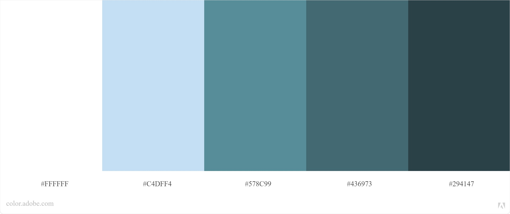
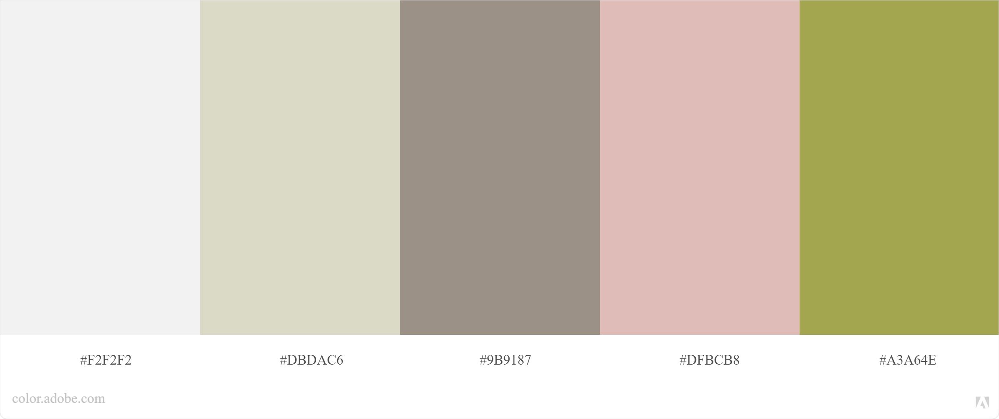

# Charte Graphique

## Couleurs :
- Voir "Blue_Theme.jpeg"
 

- Voir "Green_Theme.jpeg"
Utilisé page "Photographies"

Maybe I won't use it idk yet
--> I need more neutral colors

### /!\ Blue is way too used....

So ! Here's my color palette !
(reminds me of plants I love it so much 🥰🥰)

 

### This theme will be used in the portfolio !

-------------

## Polices :
- [Bebas Neue](https://www.dafont.com/fr/bebas-neue.font) utilisée pour les titres en priorité

-  utilisé pour la barre de menu descendante !

-------------

## Favicon :
- Not decided yet...
- Should I make my logo ? (LM)

---------------------------

## Navigation / Menu

- Accueil
- A propos
- Mes compétences
- Mon parcours

-------------

Note 

/!\ /!\ /!\ /!\ /!\ /!\ /!\ /!\ /!\ /!\ /!\ /!\

Concordance : 
- Polices
- Couleurs
- Animations !
- Images / Style d'images
- Transitions (si trop : surchargé, si trop <> amateur donc opter pour des **transitions sobres** !)

